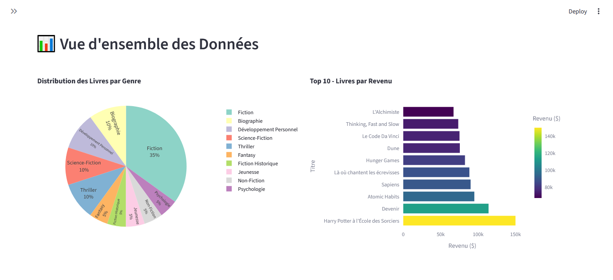
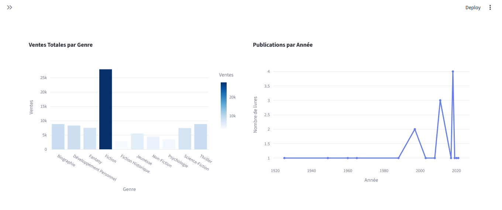
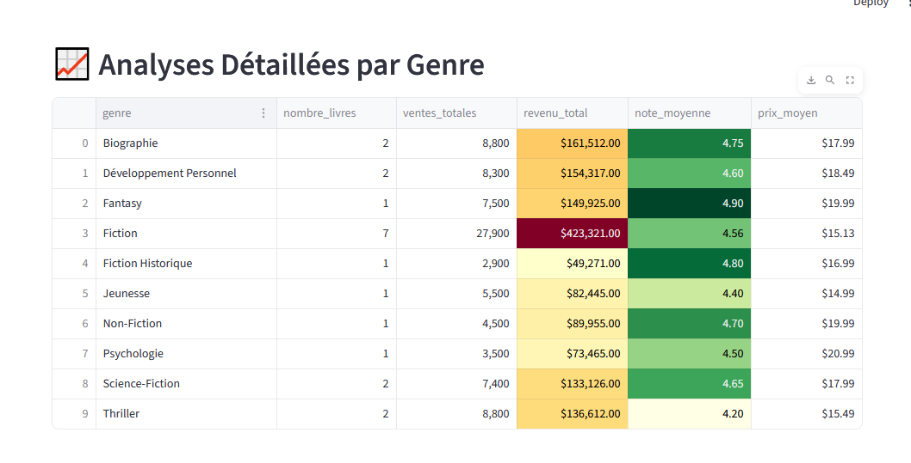
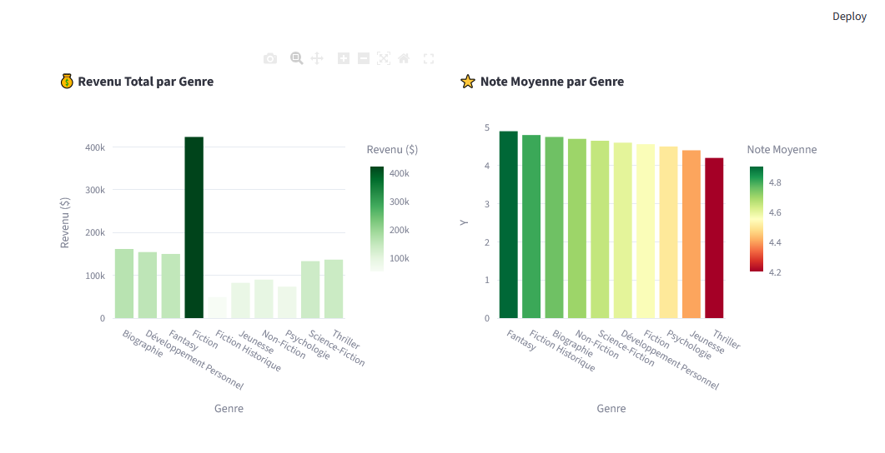
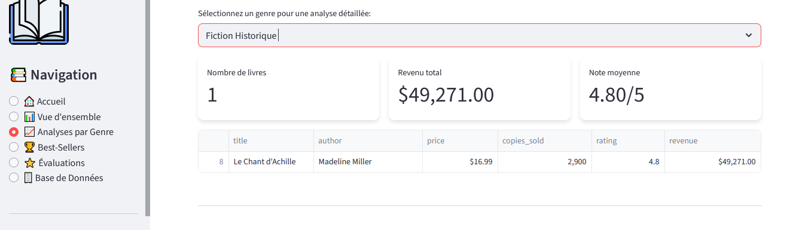
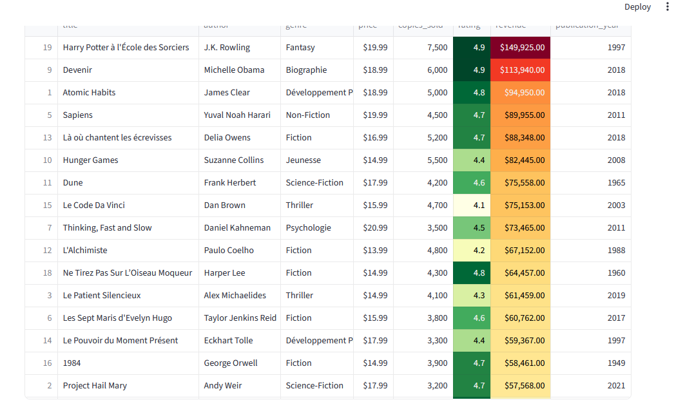

# 🏆 ETL Dashboard pour les livres– Streamlit App 

Ce projet est une application **Streamlit** interactive qui présente un tableau de bord ETL complet pour les livres en utilisant SQLITE comme base de donnée.

---

## 🚀 Fonctionnalités

- **Affichage des livres** 
- **Liste des livres les plus vendus** 
- **filtrage des livres** par genre et par vente
- **Analytics avancées** :
  - vente totals  
  - publication par année  
  - vente moyenne et note moyenne par genre
  - requette personalisé
- **Interface moderne** avec thèmes CSS personnalisés

---
